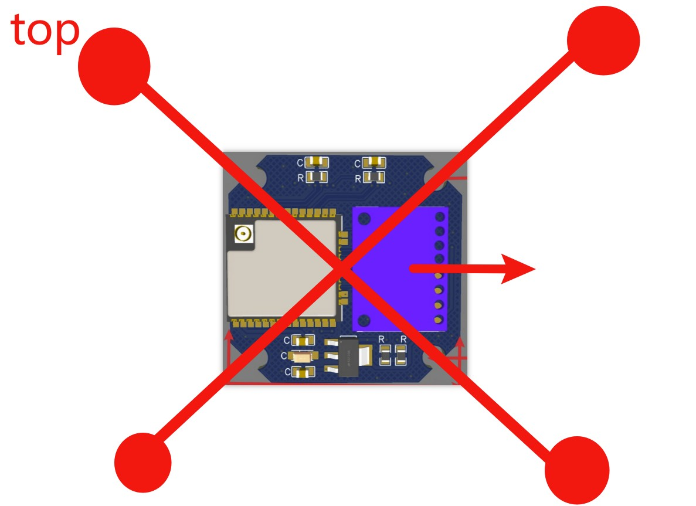

## **Jump**
* [Intro](#intro)    
* [Features](#features)   
* [Parameters](#parameters)
* [Getting started](#getting-started)
* [Hardware](#hardware)
* [Software configuration](#software-configuration)
* [Upload the code](#upload-the-code)
* [Note](#note)
  
  

## **Intro**
A flight controller based on ESP32 for quadcopters. <u>In this document, I will use [esp_quad_v4.1](https://github.com/ic1414/esp_quad/tree/main/src/esp_quad_v4.1) and [pcb_v2](https://github.com/ic1414/esp_quad/tree/main/pcb/pcb_v2) to make examples.</u>
  
  

## **Features**
* Using Arduino IDE  
* Supports PID tuning by webpage
  
  

## **Parameters**
* **MCU:** ESP32-WROOM-UE or ESP32-WROOM-32D    
* **Gyro+Accelero:** MPU6050(GY521 module)    
* **ESC protocol:** DSHOT, PWM(1ms-2ms), PWM(analogWrite())    
* **Receiver protocol:** SBUS, builtin NRF24L01    
* **Mounting hole:** 30.5mm * 30.5mm    
* **Size:** 39.75mm * 39.12mm    
* **Input voltage:** 5V/3.3V    
* **Working voltage:** 3.3V    
* **Connectors:** JST SH1.0 4PIN and JST SH1.0 6PIN
  
  

## **Getting started**
**Install ESP32 boards(version 1.0.6):** If you dont know how to install it, you may follow this [tutorial](https://randomnerdtutorials.com/installing-the-esp32-board-in-arduino-ide-windows-instructions/) I found online..  
**Install libraries:** Download the latest version of the [code](https://github.com/ic1414/esp_quad/tree/main/src/esp_quad_v4.1), unzip the [library folder](https://github.com/ic1414/esp_quad/blob/main/src/esp_quad_v4.1/esp_quad_v4.1_lib.zip) and paste the **contents of the library folder** to <u>C:/Users/(___user_abc___)/Documents/Arduino/libraries</u>
  
  

## **Hardware**  
This PCB does not have silk screen for identifying component, so please use [Fig1](#fig1)  and [Fig2](#fig2) for references.

The <u>22uf 6.3V typeA capacitor</u> in [Fig1](#fig1) is a tantalum capacitor, make sure it is mounted in the  correct orientation because it has polarity.  
The 2 resistors that are not circled are 0 ohm resistors, so we can simply short the pads by solder, but we only need to short one of them. You can find the details [here](#about-the-resistors-and-power-input).  

#### **Fig1**
 
  

The 8 resistors that are circled in [Fig2](#fig2) are voltage divider resistors. You can find the details [here](#voltage-divider).  

#### **Fig2** 
   

### **About the resistors and power input**  
One of the methods for supplying power to the board is to connect the battery to a buck converter(make the voltage lower) and then supply to the LDO on the board.  

The 2 resistors circled in pink([Fig3](#fig3)) select which pin of the <u>battery input port</u>([Fig4](#fig4)) is going to connect with the <u>buck converter port</u>([Fig4](#fig4)). If you want to connect the 4s pin of the battery input port to the buck converter port, short the right pad([Fig3](#fig3)); if 3s, solder the left one.

#### **Fig3**
 

#### **Fig4**
   

### **Voltage divider**  
If you are using commercial transmitters, you will not need to set up the voltage divider because you can not receive data from the flight controller.  
#### **Fig5**
  

### **Gyro & Accelero**
[Fig6](#fig6) shows how MPU6050 is soldered.  
#### **Fig6**
  
  

## **Software configuration**
Please follow this [tutorial](mds/esp_quad_tutorial_config.md) for more details.  
  

## **Upload the code**
Open Arduino IDE and set the development board like [Fig7](#fig7).  
#### **Fig7**
  

Setup a circuit like [Fig8](#fig8). (The green thing is a switch, in order to upload the code, we need to pull IO0 of ESP32 to low when it boots).  
#### **Fig8**

  

## **Note**
This is the default software orientation. Go [here](mds/esp_quad_tutorial_config.md) for more details.

